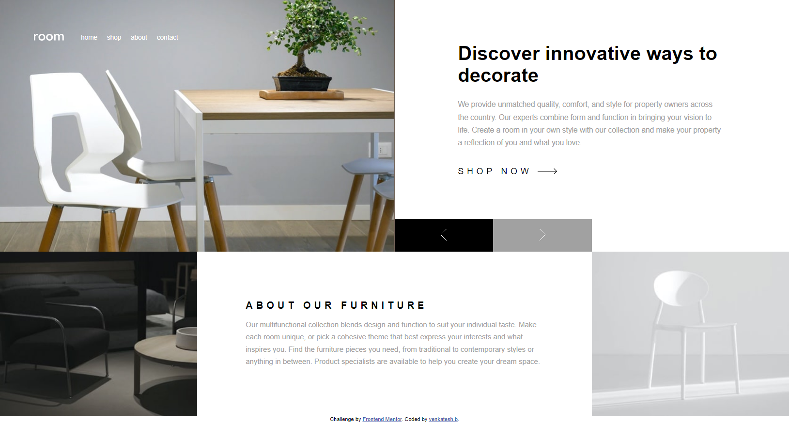

# Frontend Mentor - Room homepage solution

This is a solution to the [Room homepage challenge on Frontend Mentor](https://www.frontendmentor.io/challenges/room-homepage-BtdBY_ENq). Frontend Mentor challenges help you improve your coding skills by building realistic projects.

## Table of contents

- [Overview](#overview)
- [The challenge](#the-challenge)
- [Screenshot](#screenshot)
- [Built with](#built-with)
- [Continued development](#continued-development)
- [Author](#author)

## Overview

This challenge is from frontend mentor where new challenges were to developer your frontend skills.This particular challenge uses mainly html and css.

### The challenge

You can use any tools you like to help you complete the challenge. So if you've got something you'd like to practice, feel free to give it a go.

Your users should be able to:

- View the optimal layout depending on their device's screen size
- See hover states for interactive elements

### Screenshot

### Links

- Solution URL: [https://github.com/venkateshbaddela/room-homepage-master]
- Live Site URL: [https://venkateshbaddela.github.io/room-homepage-master/]

### Built with

- Javascript
- Semantic HTML5 markup
- SASS
- CSS custom properties
- CSS Grid
- Desktop-first workflow

### Continued development

I want to continue focusing on different css tools like grid and flexbox more in future projects.

## Author

- Frontend Mentor - [@venkateshb](https://www.frontendmentor.io/profile/yourusername)
